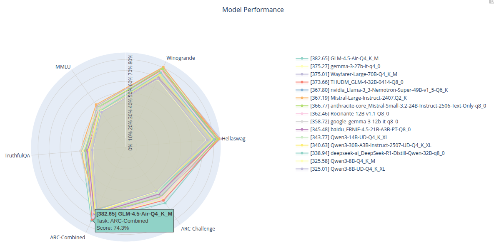

# gguf-eval

An evaluation framework for GGUF models using llama.cpp.

## Getting Started

1. Install llama.cpp.
2. Install requirements: `pip install -r requirements.txt`
3. Get some models.
4. Evaluate on all available tasks: `python evaluate.py model1.gguf model2.gguf ...`

### Details

* Unless you installed llama.cpp so it is available from the shell, you need to pass a --llama_path to the llama.cpp directory: `python evaluate.py --llama_path ../llama.cpp model1.gguf model2.gguf ...`
* If you need to pass arguments to llama.cpp for all models you can use `--llama_args "\--arg1=x"`.
* If you need to pass arguments to llama.cpp for a specific model in your list only, you can use `--model_args`: example: `python evaluate.py llama-x.gguf nvidia-nemotron-49b.gguf GLM-4.5-Air.gguf --model_args emotron:"-ts 10/18" --model_args GLM-4.5-Air:"--n-cpu-moe 22 -ts 24/10"`
* You can select or exclude tasks using the `--tasks` argument: `python evaluate.py ... --tasks exclude:mmlu,hellaswag`

## Render Plot

After running evaluate.py on some tasks, you can plot these. The results look something like this:

1. You need plotly: `pip install plotly`
2. Run `python plot.py model1.gguf model2.gguf ...`.

### Details

* You can use `--overlay` to display all models in one graph, overlayed.
* You can normalize the scores using `--normalization`. There are two modes, `cap` and `range`. `cap` means the models are all normalized so that the best performing model gets a 100% score, and the other models proportionately to that. E.g. if the model scores are 0.1, 0.2, and 0.3, this will be displayed as 33, 66, and 100% respectively. `range` means the models are normalized so that 0% is the worst performing model and 100% is the best performing model. The previous case would display as 0%, 50%, and 100%. The default is `none`.
* The default behavior is to generate a html file and open in your browser. You can instead use e.g. `--renderer=png` to output to a png file, although the quality of this is not great at the moment.
